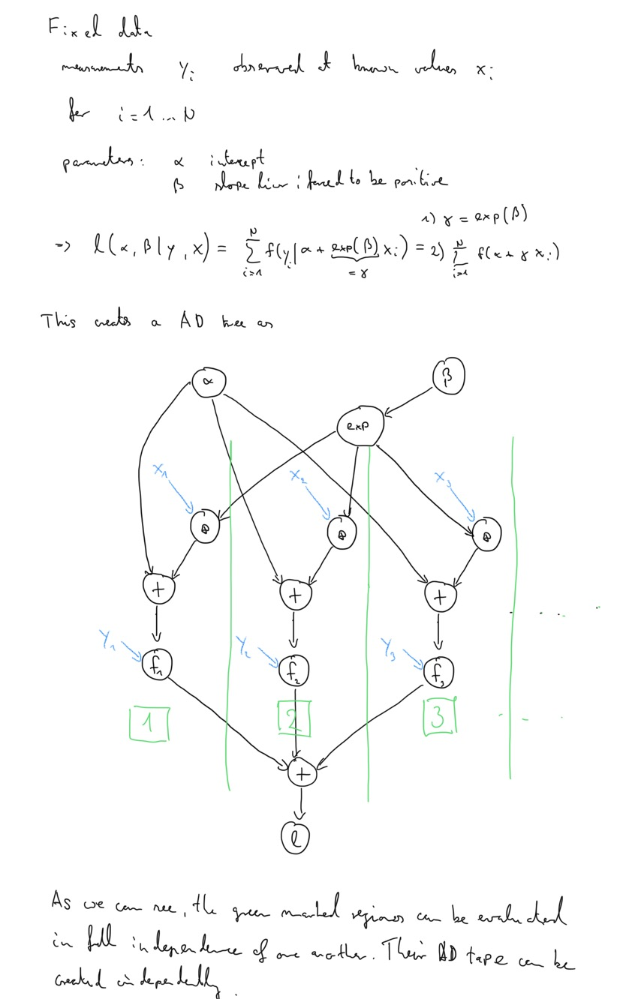
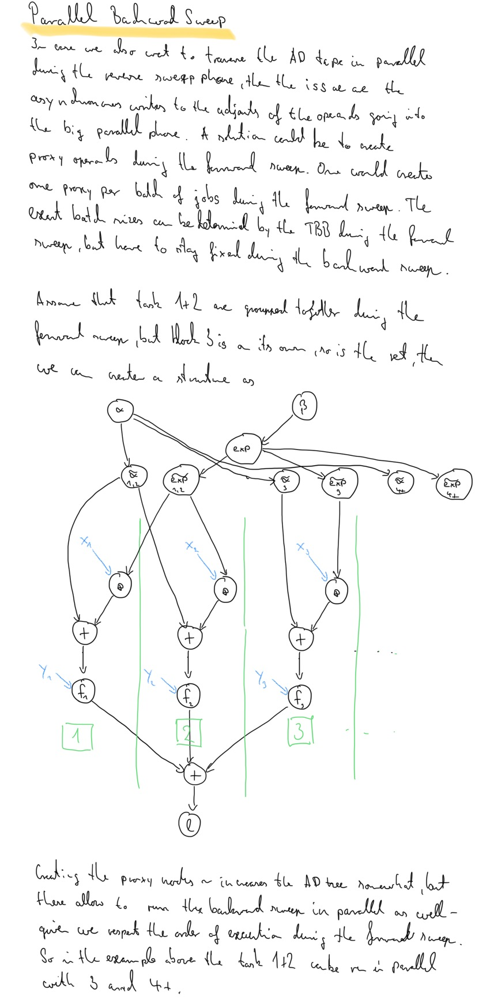

- Feature Name: parallel_ad
- Start Date: 2019-04-20
- RFC PR: (leave this empty)
- Stan Issue: (leave this empty)

# Summary
[summary]: #summary

The goal of this RFC is to expand the CPU based parallelism
capabilities of Stan math. This RFC proposes to introduce a new
parallel map with automatic sharding and a parallel reduce which
combines automatic sharding with vectorization.

# Motivation
[motivation]: #motivation

Currently `map_rect` allows map parallelism, but it brings a few
restrictions:

1. Very user unfriendly due to the requirement to pack and unpack data
   and parameters passed into the function.
2. The user must provide a sensible sharding block size.
3. Vectorization must be traded for parallelism in most applications
   (users have to pack work into shards).

In short, we currently make it very hard for users to use parallelism
and moreover the current facility cannot speed up problems where we
have to give up vectorization in exchange. 

This RFC intends to make parallelism available to a much broader user
base in a user-friendly way (addressing point 1+2) and that
parallelism will scale much better as vectorization is combined with
parallelism in a coherent approach (point 3).

So ideally we can get more users in need for parallelism to actually
use it and I also expect that vectorized parallelism will greatly
enhance the problem set where parallelism actually speeds up a Stan
program. For example, `map_rect` right now is not able to speed up
programs which can take advantage of vectorization, but still have to
process medium to large data sets. A parallel reduce with automatic
sharding and vectorization will instead allow to speed up such
applications in full automation. Therefore, the cpu resources
allocated to a Stan chain can be scaled as needed (nowadays one can
get up to 96core machines on clusters or the cloud like AWS).

Clearly large Stan runs which take multiple hours will benefit from
the proposed parallelism, but even smaller problems can be
speed up whenever sufficient CPU cores are available.

Use cases where this RFC will add value by speeding up execution are:

- Parallel accumulation of independent log-likelihood terms with very
  good scalability. The good scalability is achieved by combining
  automatic sharding with vectorization.
- Parallel evaluation of map where each iteration is independent.

# Guide-level explanation
[guide-level-explanation]: #guide-level-explanation

The proposed signatures for the parallel map/reduce with automatic
sharding is

```c++
template <class InputIt, class UnaryFunction>
constexpr auto parallel_map(InputIt first, InputIt last,
    UnaryFunction f)
    -> std::vector<decltype(f(*first))>;

template <class InputIt, class T, class BinaryFunction>
constexpr T parallel_reduce_sum(InputIt first, InputIt last, T init,
    BinaryFunction f)
    -> T;
```

The function signatures follow C++ standard library conventions. The
`InputIt` are iterators which are assumed to allow for random access, the
function objects are passed by value and these are expected to have
signatures as explained below. How these functions are exposed in the
Stan language will depend on the forthcoming features closures and
lambdas. As these are not yet available, the functionality could be
exposed in Stan with custom c++ user defined functions like this

```stan
functions {
  // runs reduce over the index range start to end. Mapping from
  // data-index set to group indices pre-stored in gidx
  real hierarchical_reduce(int start, int end, int[] y, vector log_lambda_group, int[] gidx) {
    return poisson_log_lpmf(y[start:end]| log_lambda_group[gidx[start:end]]);
  }

  // user function defined in C++ which calls parallel_reduce_sum with a
  // lambda functor which simply binds the arguments passed into it
  real parallel_hierarchical_reduce(int[] y, vector log_lambda_group, int[] gidx, int grainsize);
  
  real hierarchical_map(int g, vector log_lambda, int[,] yg) {
    real lp = poisson_log_lpmf(yg[g]| log_lambda[g]);
    return lp;
  }
  
  // user function defined in c++ based on parallel_map
  real[] parallel_hierarchical_map(int[] group, vector log_lambda, int[,] yg);
}
```

The respective user defined C++ functions merely generate small lambda
functors calling the stan user functions and pass these to the C++
signatures from above. The complete source of the above example is
given in the appendix.

The proposed C++ parallel reduce and map are formulated with general
c++ signatures as they are expected to be useful as utility functions
of their own in order to use them as building blocks to create super
nodes which themselves execute code in parallel.

## Parallel Automatic Differentiation Requirements

The proposed functions allow for out of order execution of
computationally independent tasks in different processes
(threads). For the reverse mode autodiff tape a per process/thread
global ad tape is created in order to track all operations needed to
calculate the gradient of the target function. The key assumption so
far has been that the target function is evaluated within a single
process or a single thread only. The intent of this RFC is to enable
an evaluation of the target function using multiple threads
concurrently whenever the respecitve parallel functions proposed in
this RFC are called.

The reverse mode autodiff calculations occur in two stages. During the
first forward sweep the global ad tape is created and the resulting
tape represents a topological sort of the operations making up the
target function. In the second stage, the partial derivatives are
propagated along the ad tape to calculate the final gradient of the
target quantity wrt to operands of interest. The aim of this RFC is to
enable parallelism during the *forward sweep* when the ad tape is
created.

Pre-requisites:
- all calculations during parallel reduce or map must be independent
  from one another
- each calculation must only depend on operands created prior to
  entering the parallel reduce or map (and these must not be altered)

Requirements for parallel reverse mode autodiff during forward sweep
ad tape creation:
- possibility to dispatch work to the Intel TBB task scheduler. This
  requires that independent chunks of work can be reordered (no more
  unique topological sort of operations).
- possibility to create parts of the ad tape in different processes
- actual chunking of independent tasks should be variable (to allow
  the Intel TBB to control work chunk size according to CPU load)

Post-conditions:
- the reverse mode sweeps will produce the same partials, but
  numerical difference attributed to floating point arithmetic
  reorderings are admissible
- after parallel execution of independent chunks, the independent
  chunks shall be merged together to form again a single large tape.
  An alternative approach is to avoid the stitching and instead grow a
  tree like structure which stores the information as to which
  independent chunks belong together in what order. For the reasons
  given in the rationale and alternatives section, the suggestion here
  is to go for now with the merging approach.


A graphical representation of the parallel forward sweep is shown
below.



Enabling parallelism for the reverse sweep is possible, but requires
greater control over the inputs as outlined in the appendix of this
RFC. This is a complimentary feature which can be added at a later
stage without additional structural changes to the AD structure in
general. Instead more flexible and general `parallel_map` and
`parallel_reduce` signatures are needed which are essentially n-ary
functions which forward the shared arguments to the user functor.

## Parallel Map

The `UnaryFunction` function object recieves dereferenced iterators
fromt the `InputIt` sequence. The function is expected to return the
same type of object for all evaluations in the sequence (only void
would not be allowed).

The parallel map facility is very similar to the existing `map_rect`
with a few changes:

- The input sequence are iterators which can point to arbitrary
  containers (like a std vector of whatever) or these can be mapped to
  count iterators so that the function to be evaluated gets integer
  indices.
- The output from the parallel map will always be a std vector and
  each element is the result of the respective function evaluation.

In practice, the parallel map will map the input iterator sequence
onto an index set which defines the output std vector. Doing so makes
every function evaluation per element of the input sequence fully
*independent* of any other evaluation. Note that the function only
requires that each element is of the same c++ type, but it's actual
shape is allowed to vary between elements (so returned Eigen matrices
would be allowed to have different sizes from element to element). A
direct export of the function to the Stan language may need additional
considerations.

## Parallel Reduce

The `BinaryFunction` function object is called with dereferenced start
and end iterators which represent a continuous sub slice of the input
sequence. The end iterator will refer to the last element of the to
be reduced sub slice of the input sequence (so it includes the last
element). The function is expected to reduce the sub slice and to
return an element of the same type as the initial provided to the
reduce facility. The individual elements returned from multiple sub
slices will be summed together. Therefore, summation of two returned
elements must result in the same scalar type and the summation must be
associative as the summation order is not necessarily guaranteed.

Note that the actual slicing of the input data is not performed by the
reduce function itself. Instead, the actual sub slicing is left to the
user provided function which knows best how to do that (and slicing is
implemented in Stan itself already, so we should not duplicate this in
math). In practice, it makes most sense for Stan programs to use
counting iterators. Doing so will make the binary function receive
starting and end indexes (given as integers) which represent the sub
slice of data to do the actual reduction over. The actual data
involved then must be part of the closure of the function object
`BinaryFunction` passed into the facility.

Please refer to the appendix for an example code snippet for
demonstration purposes.

# Reference-level explanation
[reference-level-explanation]: #reference-level-explanation

The overall strategy to implement all of this is based on

- Refactor the reverse mode autodiff to work with the task based
  approach of the Intel TBB. In essence this will mean to allow for
  independent evaluations of functions where each independent
  evaluation can be written to different ad tapes which are combined
  together. This is essentially a type of nested autodiff (but it’s
  more general and different).
- Expose the `parallel_for` (as a map type function) of the TBB. This
  is essentially a `map_rect` with automatic sharding.
- Expose `parallel_reduce` of the TBB. This will bring automatic
  sharding and combine this with vectorization.

Exposing these functionals to Stan is left as a topic to
discuss. Either closures are used directly or the parser has to create
C++ lambda functors. Using simple C++ user provided functions, the
appendix includes a fully working example for the suggested
constructs. The C++ user code are kept minimal and would need to be
replaced by means of the new stanc3 parser.

Reverse mode autodiff needs some refactoring to work with the task
based approach of the TBB. However, we don’t need to deal with TBB
tasks ourselves atm, since we can just use parallel map and parallel
reduce. These TBB algorithms chunk the work to be done into
inter-dependent tasks (these algorithms are examples of so-called data
parallel programming in TBB jargon). How these are executed is nothing
we can control in great detail. Internally the Intel TBB uses a thread
pool to do the work, but that may actually change.

In the following I will in step 1 explain what it needs to make
stan-math's reverse mode AD compatible with the Intel TBB (actually we
refactor it in a way which will be general and not TBB specific). This
will highlight the need for a new concept of independent autodiff
(step 2) operations to allow function evaluation in parallel and it
will also highlight the need to refactor the current nested AD
approach (step 3). Those two pieces are described in their respective
sections as well.


## Step 1: Refactor Reverse Mode AD for Parallelism (with the TBB)

For reverse mode ad we have to keep track of the relations between the
operands in order to calculate gradients. The written ad tape is right
now a deterministic-ally ordered topological sort of all operations
involved in evaluations of the function of interest. The key to
parallelism now is to allow that **independent** function evaluations
can be performed in any *order* and in any *context*. Therefore,
permutations of independent function evaluations on the global ad tape
are permissible.

It is useful to contrast this with nested autodiff:

- Nested ad allows to perform ad in complete separation of an outer ad
  tape. Thus, whenever we start a nested ad operation and then stop
  it, we do delete everything from the nested ad tape.
  
- Independent ad is more general in that the independent chunks can be
  written to independent ad tapes during the independent execution
  phase (and the operands from the outer ad tape can be referred to
  from the independent ad tapes). Once a region with independent chunk
  execution finalizes we do not discard the results, rather we need to
  merge the independent contributions to the originating ad tape. It's
  like nesting without deleting the AD tape afterwards, but rather we
  use multiple AD tapes to represent one big gradient.

As a first step towards independent execution we will need to refactor
nested ad. The issue is that it is right now a global operation on the
AD tape in a given thread. However, since the TBB executes work chunks
at arbitrary order in arbitrary threads a given function must not fire
an operation which affects the AD tape in a given thread
globally. Instead, nesting has to be a local operation which is
explained furhter below in more detail. The basic idea is to introduce
a linked list of independent ad tapes.

## Step 2: Independent AD

An independent AD tape is represented by a `ScopedChainableStack`
object. The `ScopedChainableStack` provides a class which manages its
own ad tape. In a given thread only one `ScopedChainableStack` can be
active at a time. Thus, the `ScopedChainableStack` can set the thread
local pointer to the thread local ad tape to its own copy of
it. Activating a `ScopedChainableStack` will cause all further ad
operations to be written to the local copy of that instance.

The `ScopedChainableStack` has these public member functions:

- `template <class Functor> Functor evaluate(Functor f)`: Evaluates
  function f *within* the context of a local tape. That it, the
  function starts by activating the local ad tape copy as the thread
  local ad tape before execution of `f` and deactivates its own tape
  and restores the previous state of the thread local AD tape to what
  it pointed to before. This way all operations of `f` are recorded on
  the local AD tape.
- `append_to_parent_stack()`: Adds the ad tape stored with the instance
  to the parent state and flushes its own ad tape. The ownership of
  the associated memory pool is transferred to the parent as well.
- `recover()`: Recovers the memory from the local tape, but keeps all
  memory reserved. This is needed for a re-use of the independent AD
  tape whenever we do not want to keep track of the AD tape (providing
  an alternative to the current nested AD approach).

With such a `ScopedChainableStack` object we can then easily interface
with the TBB. The idea is to have one instance of `ScopedChainableStack`
per thread which gets used during the parallel map (or reduce) of the
TBB. The TBB provides such a lazy thread local storage (see [tbb
doc](https://software.intel.com/en-us/node/506244)). Whenever the TBB
dispatches some work to a task we can then simply use the thread local
`ScopedChainableStack` instance to perform with its `execute` function the
work which needs to be done. This will in effect write all ad terms to
the instances of the `ScopedChainableStack`. The key here is that we
have a locally scoped context and within a given execution context we
are collecting all ad terms to the local ad tape . Once the parallel
region is completed, the independent contributions to the ad tapes are
scattered over the different `ScopedChainableStack` instances. The
simplest way to process now is to append each ad tape to the
originating parent ad tape.

Appending everything to a single tape is not as efficient as it could
be and we may revise this at a later time point. One could instead
link the independent ad tapes to one another, but this requires more
effort than it looks as we do not have all functions of the vars as
virtual functions (for performance reasons).

The core of the `parallel_map` for reverse mode can look like this:

```c++
// we process num_jobs here
tbb::parallel_for(tbb::blocked_range<std::size_t>(0, num_jobs),
    // the TBB automatically chunks the work into blocks
    // which are sub slices of overall number of jobs
    [&](const tbb::blocked_range<size_t>& r) {
        // tls_scope_stacks.local() returns a thread-local instance of
        // ScopedChainableStack
        // from that instance we call the execute method to do the
        // work in the currently active worker thread as scheduled
        // by the TBB. All AD terms are written to the thread local
        // AD tape.
        tls_scoped_stacks.local().execute([&] {
            // first is the starting iterator
            auto elem = first;
            // which we advance to the item we want to process
            std::advance(elem, r.begin());
            for (std::size_t i = r.begin(); i != r.end(); ++elem, ++i) {
                f_eval[i] = f(*elem);
            }
        });
});

// combine_each is a TBB function which applies the given functor to
// each ScopedChainableStack instance which was created. Per thread
// used above there will be one such instance
tls_scoped_stacks.combine_each(
    [&parent_stack](ScopedChainableStack& child_scoped_stack) {
    child_scoped_stack.append_to_parent();
});
```

The `parallel_reduce_sum` is a bit more complicated, but the idea is
exactly the same as above.

## Step 3: Refactor of Nested AD

The main problem of nested AD as of now is that it changes globally
the state of the AD tape in a given thread. This is against the
guiding principle of executing things in independence and in a local
scope. However, there are even deeper problems with the current nested
AD approach. The issue is that nested AD is by design unsafe to use
and can only be used with a `try-catch` construct in a safe way. 

Right now we usually do nested ad as

```c++
    try {
      start_nested();

    // nested operations

    } catch (const std::exception& e) {
      recover_memory_nested();
      throw;
    }
    recover_memory_nested();

```

So, we always have to deal with catching exceptions to deal with
cleanup of the ressources for the nested context. This is not ideal as
the ressource management should be deferred to C++ language
features. **My recommendation is therefore to deprecate the existing
nested AD** and replace it with a pattern which is based on independent
AD using the `ScopedChainableStack` as introduced. The proposed
pattern then would look like:

```c++
ScopedChainableStack local_ad;

local_ad.execute([]() {
   // nested operations
});

// in case we want to re-use the AD tape (as for iterative
// applications like ODE integration)
local_ad.recover();

```

The upside is that everything is safe to use by design of things. No
more need for `try-catch` blocks. Should the function passed to
`execute` fire an exception, then the destructor of all members of
`ScopedChainableStack` is called and thus all ressources are
freed. Evenutally such a pattern could be used in general (even for
non-nested AD), but let's not go too fast here as this raises a few
problems.

In order to keep the existing API stable I suggest to refactor things
in the following way. First off, currently we do nested AD on the
thread global AD tape by storing positions in the AD tape which save
as to what slices of the AD tape correspond to which level of
nesting. That is a lot of bookkeeping and causes nesting to be a
global operation. Instead I am proposing to replace this with a linked
list of independent AD tapes.

For this we may enhance the current `AutodiffStackStorage` struct
which holds our AD tape with facilities needed to link individual
tapes. Only a single instance can be *active* in a given thread. Each
instance knows the previously active AD tape in a given thread. Upon
deactivation the previously active AD tape is activated automatically
again.

Please refer to the appendix for a possible skeleton of code
implementing the design 


# Drawbacks
[drawbacks]: #drawbacks

Why should we *not* do this?

- Life gets a bit more complicated with this and it’s a considerable
  change under the hood of Stan. Although I think that we are doing a
  change of terminology here for the good. Thus we generalize nested
  AD towards independent AD and allow for permutations in the
  topological sort of the autodiff tree whenever that is permissible.
- We are going from one global ad tape to many small ones whenever
  parallelism is used. The memory pool so far was grown only once and
  then stayed static in size. With many small ad tapes we will merge
  the independent ones into the originating one and when doing so only
  the ownership of the memory blocks will be transferred, but at each
  re-evaluation we will re-allocate the memory again. This can be
  addressed by a more clever memory pool. My suggestion is to monitor
  the performance penalty incurred by this. However, note that
  programs not using parallelism will not have any changed behavior.
- The new implementation for the old nested AD will be slower for
  iterative things like ODE solving. The reason is that always using a
  new independent AD tape requires to re-allocate it's needed memory
  upon each iteration in the ODE integration process. However, if one
  switches over to the more safe new pattern, then we retain the same
  performance as we can then simply `recover()` the memory in the same
  way as before which keeps the memory allocated, but ready for
  reuse. Thus, the `coupled_ode_system` and the `algebraic_solver`
  will need a light refactor to use the new scheme.
- The suggested building blocks per se only parallelize the *forward*
  sweep of reverse mode AD, but not the reverse sweep. Thus, the
  operations which involved `adj_jac_apply`, for example, are not
  speedup at all with this. However, this can be resolved by enhancing
  the proposed functions as detailled in the appendix. In short,
  greater control over the input operands is needed to correctly
  synchronize the backward sweep. The AD tape does not need
  further structural changes and this is a complimentary feature. 
  
# Rationale and alternatives
[rationale-and-alternatives]: #rationale-and-alternatives

- Why is this design the best in the space of possible designs? I
  think the approach is incurring minimal changes to Stan in order to
  make it work with the TBB. The key is to refactor nesting and
  introduce `ScopedChainableStack` in order to allow for local execution
  contexts. The guiding principle is to have independent AD tapes used
  in local contexts. This fits nicely into the TBB, but the introduced
  abstraction is useful regardless of the TBB.
- What other designs have been considered and what is the rationale
  for not choosing them?
  An alternative approach is to allow the AD tape to grow in many
  independent sub-trees. So after each parallel phase the chunks are
  not merged together to form a single AD tape. These sub-trees are
  then linked together in a tree-like structure which must allow for
  traversal in reverse order as needed during the reverse sweep. The
  upside of this approach is better speed as overhead incurred by
  merging sub-trees into the master tree is avoided. This design has
  been disregarded, because
    * increased complexity, we would need to manage another level of a
      tree structure.
    * fundamental change to the AD tape data structure which may have
      many side-effects (all global operations like
      `set_zero_adjoint`, `recover_memory`, ... all need a rewrite)
    * introducing trees of trees data structures can be left as a
      later generalization. Such a generalization could deal at the
      same time with many-device representations of a single AD tree
      as would be ideal for GPU devices or even MPI backends.
  
# Prior art
[prior-art]: #prior-art

The Intel TBB is around for more than 10y now and has been used for
many scientific applications. Grounding Stan on this makes a lot of
sense as we get a lot of knowledge for free here.

Other than that this is a big extension of nested ad as we introduce
independent ad.

In summary we make Stan fit for parallelism and plug it into the
TBB. The key concept here is independent ad which is independent of
the TBB.

# Unresolved questions
[unresolved-questions]: #unresolved-questions

- What parts of the design do you expect to resolve through the RFC
  process before this gets merged?
  1. What will be the best strategy to slice it into individual PRs.
  2. The proposed function signature for the parallel map and reduce
  are very much in line with the standard c++ library, but maybe not
  so with the Stan math notions...so using iterators is not done
  usually, but I think it will give us more flexibility in the future
  as to how we use these facilities (internally inside stan-math or
  other c++ programs). By that I envision that the parallel map will
  not only be used by Stan users, but can also be used inside the Stan
  math library.
  3. We could even consider to pass start and end iterators into the
    BinaryFunction for the reduce function. The reason to do so is
    that the iterators themselves represent the sub slices better than
    the dereferenced ones. With the current design to use dereferenced
    iterators we will end up using most of the time counting iterators
    which are effecivley integers. The down-side of using iterators is
    that these cannot be passed directly into Stan user functions as
    we do not support iterators in the language.
 - What parts of the design do you expect to resolve through the
  implementation of this feature before stabilization? I have a
  working prototype of all of this on an experimental branch
  `parallel-ad-tape-3` which I actually like at the moment. The
  prototype already shows the gains of these ideas. Things to settle
  on:
  1. Are we ok with merging all independent AD tapes to a single big
    one by copying them together? This leaves an obvious point for
    optimization as we could link the independent AD tapes with a
    special var type. However, for a start the copying is fine, but it
    does limit the scalability of the approach and we should resolve
    this by a special var type allowing us to grow a linked list of
    independent AD tapes.
  2. We need to settle on what control we give users on the reduce. It
  can be made deterministic and we could expose different queuing
  strategies (simpler ones are better for small problems while more
  complex work stealing is better with compute heavier jobs from my
  first experience ).
- What related issues do you consider out of scope for this RFC that
  could be addressed in the future independently of the solution that
  comes out of this RFC? 
  1. Linked independent AD tapes as mentioned above in point 1. This
     is better adressed in a second refactor which targets to
     represent the AD tape on different devices (GPU, MPI).
  2. A more clever memory pool accomodating that we end up having many
     independent AD tapes. From benchmarks I have done this is not
     really a bottleneck though.  

# Appendix


## Parallel Reverse Autodiff




## Example `parallel_map`

Here is a simple unit test which demonstrates the use of the
`parallel_map`:

```c++
// we evaluate the following binary function over a large number of
// inputs

// fun1(x, y) = (x^2 * y) + (3 * y^2)
struct fun1 {
  template <typename T>
  inline T operator()(const Matrix<T, Dynamic, 1>& x) const {
    return x(0) * x(0) * x(1) + 3.0 * x(1) * x(1);
  }
};

TEST(Base, parallel_map) {
  const int num_jobs = 1000;
  // Here we use simple integer indices for the iterators
  typedef boost::counting_iterator<int> count_iter;

  vector_d x_ref_2(num_jobs);

  for (int i = 0; i < num_jobs; ++i) {
    x_ref_2(i) = 7 + i;
  }

  // UnaryFunction which returns a Eigen column vector of length 1
  auto loop_fun = [&](int i) -> vector_d {
    fun1 f;
    vector_d res(1);
    vector_d iarg(2);
    iarg << 5, x_ref_2(i);
    res(0) = f(iarg);
    return res;
  };

  // the concatenate_row takes the returned std::vector<vector_d>
  // and appends them horizontally together
  vector_d parallel_result = stan::math::concatenate_row(
      stan::math::parallel_map(count_iter(0), count_iter(num_jobs), loop_fun));

  for (int i = 0; i < num_jobs; ++i) {
    vector_d x_ref(2);
    x_ref << 5, x_ref_2(i);
    double fx_ref = parallel_result(i);
    EXPECT_FLOAT_EQ(x_ref(0) * x_ref(0) * x_ref(1) + 3 * x_ref(1) * x_ref(1),
                    fx_ref);
  }

  stan::math::recover_memory();
}
```

## Example `parallel_reduce`

In c++ code using the `parallel_reduce_sum` may look as:

```c++
// reduce functor which is the BinaryFunction
// here we use iterators which represent integer indices
template <typename T>
struct count_lpdf {
  const std::vector<int>& data_;
  const T& lambda_;

  count_lpdf(const std::vector<int>& data, const T& lambda)
      : data_(data), lambda_(lambda) {}

  // does the reduction in the sub-slice start to end
  inline T operator()(std::size_t start, std::size_t end) const {
    const std::size_t elems = end - start + 1;
    std::vector<int> partial_data;
    partial_data.insert(partial_data.end(), data_.begin() + start,
                        data_.begin() + end + 1);
    return stan::math::poisson_lpmf(partial_data, lambda_);
  }
};

TEST(parallel_reduce_sum, gradient) {
  double lambda_d = 10.0;
  const std::size_t elems = 10000;
  const std::size_t num_iter = 1000;
  std::vector<int> data(elems);
  
  for (std::size_t i = 0; i != elems; ++i)
    data[i] = i;

  typedef boost::counting_iterator<std::size_t> count_iter;
  using stan::math::var;

  var lambda = lambda_d;

  count_lpdf<var> reduce_op(data, lambda);

  var poisson_lpdf = stan::math::parallel_reduce_sum(
      count_iter(0), count_iter(elems), var(0.0), reduce_op);

  var lambda_ref = lambda_d;
  var poisson_lpdf_ref = stan::math::poisson_lpmf(data, lambda_ref);

  EXPECT_FLOAT_EQ(value_of(poisson_lpdf), value_of(poisson_lpdf_ref));

  stan::math::grad(poisson_lpdf.vi_);
  stan::math::grad(poisson_lpdf_ref.vi_);

  EXPECT_FLOAT_EQ(poisson_lpdf.adj(), poisson_lpdf_ref.adj());
}
```


## Example Stan Program

Full Stan program which simulates and fits fake data for a
hierarchical Poisson problem. In benchmarks this program demonstrated
5x speed incerases when using 6 cores on a MacBook Pro.

- [Stan model](0003-poisson-hierarchical.stan)
- [Stan data](0003-hbench_method0.data.R)
- [C++ user functions](0003-user_header.hpp)

## Refactored Nested AD Skeleton

The declaration of the `AutodiffStackStorage` could look like:

```c++
struct AutodiffStackStorage {

    // ... things needed to store the var AD tape ...

    bool is_active() const { return is_active_; }
    bool is_root() const { return is_root_; }

    // turns a given storage active and saves what was before active
    // the tape must not be active already
    void activate();
    
    // deactivates the current instance which is only allowed if
    // - it is active
    // - it is not the root instance which must persist
    // - the previous stack must not be active atm
    // it automatically activates the previously active instance
    void deactivate();

    // recover ressources such that they are freed, but still
    // allocated for re-use at a later stage
    void recover();

    // stores if active
    bool is_active_;
    // only the first instance activated in given thread is the root
    bool is_root_;
    // set to the previously active tape
    AutodiffStackStorage *previous_active_stack_;
}; 
```

Having this implemented will allow to re-implement the current
functions in stan-math for nesting as:

```c++
static inline void start_nested() {
  ChainableStack::AutodiffStackStorage* nested_instance
      = new ChainableStack::AutodiffStackStorage();
  nested_instance->activate();
}

static inline void recover_memory_nested() {
  if (empty_nested())
    throw std::logic_error(
        "empty_nested() must be false"
        " before calling recover_memory_nested()");

  ChainableStack::AutodiffStackStorage* nested_instance
      = &ChainableStack::instance();

  nested_instance->deactivate();
  delete nested_instance;
}

static inline bool empty_nested() {
  // if the root is active, then we do not have nesting
  return ChainableStack::instance().is_root();
}
```

However, for the design issue raised above (things are only safe with
`try-catch`) we should deprecate the use of these functions and
instead advocate the pattern with an independent AD tape.

